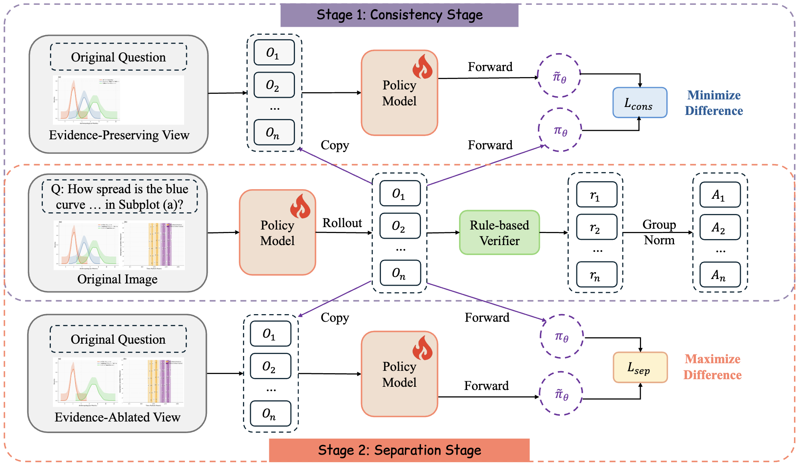
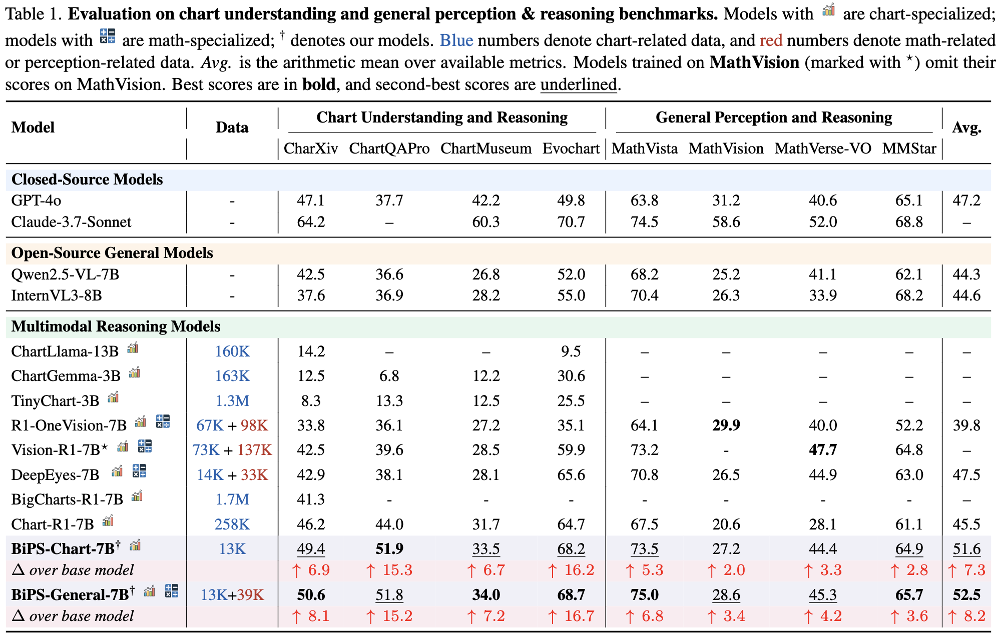

<div align="center">

# See Less, See Right: Bi-directional Perceptual Shaping For Multimodal Reasoning

<a href="https://arxiv.org/abs/2512.22120"></a>
<a href="https://huggingface.co/zss01/BiPS"></a>
<a href="https://huggingface.co/zss01/BiPS-Qwen3"></a>

</div>

## Introduction

This is the official repository for the paper "See Less, See Right: Bi-directional Perceptual Shaping For Multimodal Reasoning".

### Motivation

To mitigate the perceptual bottleneck in VLMs, recent approaches often rely on external tools or explicit intermediate visual cues (e.g., generated masks, bounding boxes, or latent tokens) during inference. However, these paradigms face three critical limitations:

- **Shape Rigidity**: Coarse boxes or masks fail to capture irregular, fine-grained evidence (e.g., thin polylines or specific intersections in charts).

- **Limited Generalization**: Task-specific tools generalize poorly across diverse domains.

- **Inference Overhead**: Multi-step visual reasoning increases computation costs and latency.
BiPS takes a different route. Instead of using visual cues as inference-time crutches, we transform them into training signals to internalize perception.

### Method: Bi-directional Perceptual Shaping

BiPS shapes the model's internal policy through a two-stage curriculum using programmatically generated views via chart code editing:

<p align="center">
  
</p>

- **Consistency Stage**: Minimizes divergence between the original image and an Evidence-Preserving View, teaching the model to focus on complete, supporting visual details.

- **Separation Stage**: Maximizes divergence from an Evidence-Ablated View, penalizing the model for relying on text-only shortcuts when visual evidence is missing.

By strictly enforcing these constraints during training, BiPS achieves fine-grained visual grounding without any additional inference cost. Across 8 benchmarks, it boosts Qwen2.5-VL-7B by an average of 8.2%, demonstrating strong cross-domain generalization.

<p align="center">
  
</p>


## 📝 Citation

If you find this work helpful in your research, please cite our paper:

```bibtex
@article{zhang2025bips,
  title={See Less, See Right: Bi-directional Perceptual Shaping For Multimodal Reasoning},
  author={Zhang, Shuoshuo and Zhang, Yizhen and Fu, Jingjing and Song, Lei and Bian, Jiang and Yang, Yujiu and Wang, Rui},
  journal={arXiv preprint arXiv:2512.22120},
  year={2025}
}
```

## Acknowledgments

This codebase is built upon [Verl](https://github.com/verl-project/verl). We thank the authors for their outstanding contribution to the community.